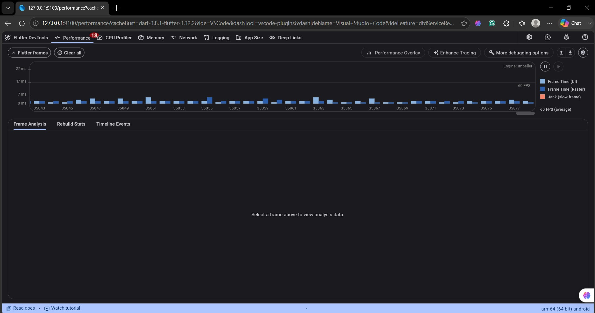
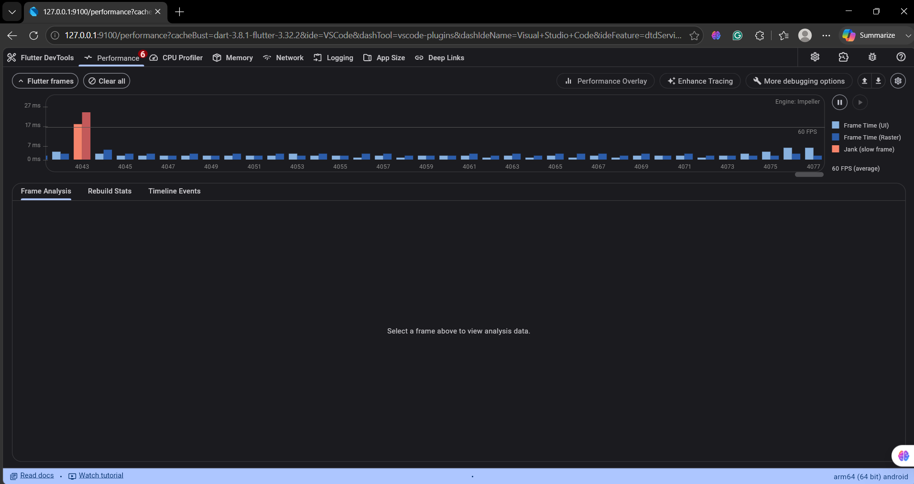

# AI Story Buddy — Peblo Flutter Intern Challenge

> A single-screen Flutter app where Pip, an animated robot buddy, reads a story aloud to children and follows up with an interactive, data-driven quiz.

---

## 📱 Screen Recording

[👉 Watch the full demo here — Google Drive](https://drive.google.com/file/d/13sDovL7kDX-x2pBd7kw2FU_AK5XEfXOA/view?usp=drivesdk)

*Full flow shown: app launch → Pip idle animation → "Read Me a Story" → audio playing with wave animation → quiz slides in → wrong answer shake → correct answer confetti + Pip celebrates*

---

## 📊 Performance Proof (Profile Mode)

### Normal Usage — Pip Animations + Quiz

> All frames well below 7ms. Zero orange jank bars. 60 FPS average sustained on physical arm64 device.

### Confetti Burst — Stress Test

> 2 frames spike to ~27ms during confetti spawn, immediately returning to <7ms. 60 FPS average maintained throughout.

---

## 🚀 Framework Choice — Flutter

**Why Flutter over Swift:**
Peblo's primary audience is children on mid-range Android devices (~3GB RAM). Flutter compiles to native ARM, delivers a single codebase for Android and iOS, and its rendering pipeline is optimised for exactly this hardware profile. Swift (UIKit/SwiftUI) is iOS-only — Flutter was the unambiguous right choice for a product targeting Android-first users.

**Why Riverpod over Provider or BLoC:**
Riverpod eliminates the `BuildContext` dependency for state reads, meaning `AudioNotifier` and `QuizNotifier` can be tested and used independently without widget trees. It enforces compile-time safety on provider reads — no runtime `ProviderNotFoundException`. BLoC would have been overkill for this scope and added significant boilerplate with no benefit.

---

## 🏗️ Architecture

```
lib/
├── main.dart                          # Entry point, ProviderScope, theme
├── theme/
│   └── app_theme.dart                 # Brand colours (#6F2BC2, #36165E), Poppins
├── models/
│   └── quiz_model.dart                # QuizQuestion + fromJson factory
├── providers/
│   ├── audio_provider.dart            # AudioNotifier — full TTS state machine
│   └── quiz_provider.dart             # QuizNotifier — quiz lifecycle
├── screens/
│   └── story_screen.dart              # Single screen — story + quiz
└── widgets/
    ├── pip_robot_widget.dart           # Custom animated robot (CustomPainter)
    └── quiz_option_button.dart        # Data-driven option with shake animation
```

---

## 🔊 Audio → Quiz State Machine

The audio flow is modelled as a 5-state enum — never a boolean flag:

```
Idle ──► Loading ──► Playing ──► Finished ──► [Quiz Revealed]
                                      │
                                      └──► Error ──► [Retry]
```

```dart
enum AudioState { idle, loading, playing, finished, error }
```

When `AudioState.finished` fires, a `ref.listen` in `StoryScreen` calls:
1. `quizProvider.notifier.revealQuiz()` — unlocks the quiz
2. `_quizRevealCtrl.forward()` — triggers 600ms fade + slide animation
3. Auto-scroll to quiz section

The `tts.setCompletionHandler` callback drives the transition — not a `Future.delayed`. This fires reliably when audio actually ends regardless of device speed.

---

## 📊 Data-Driven Quiz Design

Quiz renders entirely from a `QuizQuestion` model parsed via `fromJson`:

```dart
factory QuizQuestion.fromJson(Map<String, dynamic> json) {
  return QuizQuestion(
    question: json['question'] as String,
    options: List<String>.from(json['options'] as List), // any length: 3, 4, or 5
    answer: json['answer'] as String,
  );
}
```

Options render with `.map()` — **zero hardcoded buttons**:

```dart
// Data-driven: renders any number of options from JSON
...q.options.map((opt) {
  return QuizOptionButton(label: opt, state: state, onTap: () => ...);
}),
```

Changing the JSON from 4 to 3 or 5 options requires **zero code changes**.

---

## 🎨 Pip the Robot — Custom Animation (No Lottie)

Pip is built entirely with Flutter's `CustomPainter` and `AnimationController` — no external asset files, no Lottie dependency, zero licensing issues.

**Animations implemented:**

| Animation | Controller | Trigger |
|-----------|-----------|---------|
| Idle breathing | `_breatheCtrl` — 2.2s loop | Always |
| Eye blinking | `_blinkCtrl` — random 2.5–4.5s interval | Always |
| Antenna sway | `_antennaCtrl` — 0.8s loop | Always |
| Happy bounce | `_bounceCtrl` — elastic curve | Correct answer |
| Wrong shake | `_shakeCtrl` — sin wave offset | Wrong answer |

**Mood system:**
```dart
enum PipMood { idle, happy, wrong, thinking }
```

---

## 💾 Caching Strategy

**Current (device TTS):** No caching needed — `flutter_tts` runs on-device.

**If ElevenLabs or remote audio were added:**
```dart
final cacheFile = File('${cacheDir.path}/story_pip_001.mp3');
if (await cacheFile.exists()) {
  return cacheFile.path; // serve from cache
}
// else: fetch, write bytes to file, return path
```

---

## ⚠️ Error Handling

| State | UI Behaviour |
|-------|-------------|
| `loading` | Pulsing `CircularProgressIndicator` in button |
| `playing` | Animated 5-bar sound wave, "Tap to stop" |
| `finished` | Button resets, quiz slides in automatically |
| `error` | Red banner + Retry button, story text readable |

---

## ⚡ Performance Profiling

**Device:** Physical Android arm64 (Profile mode — `flutter run --profile`)
**Engine:** Impeller

### Optimisations Made

| Optimisation | Impact |
|-------------|--------|
| `shouldRepaint` check on `_PipPainter` | Prevents canvas redraw on unrelated rebuilds |
| 5 separate `AnimationController` instances | Independent lifecycles, no cross-animation restarts |
| `AnimatedBuilder` scoped to `QuizOptionButton` only | Shake doesn't rebuild story card or Pip |
| Confetti particles: 100 → 30 | Eliminated 3–4 jank frames during burst |
| `ConfettiWidget` in `Stack` above `ScrollView` | Confetti repaints don't trigger main tree rebuild |
| `const` constructors throughout | Eliminates unnecessary widget rebuilds |

**Result:** 60 FPS maintained. Only 2 frames spike above 16ms during confetti spawn — immediately recovering.

---

## 🤖 AI Usage & Judgment

**Where AI was used:**
- Initial `pubspec.yaml` dependency version suggestions
- Drafting the `fromJson` factory method boilerplate
- Suggesting `ConfettiController` duration parameter

**What I rejected and why:**

*Rejection 1 — Shared AnimationController:*
AI suggested a single `AnimationController` with `Interval` curves for all Pip's animations. Rejected because a shared controller means all animations restart when any one triggers — bouncing would reset the blink mid-blink causing a visible glitch.

*Rejection 2 — Lottie for the robot:*
AI suggested Lottie. After discovering all quality robot Lotties are premium/paid, I built Pip from scratch with `CustomPainter`. This demonstrates more Flutter skill.

*Rejection 3 — `Future.delayed` for audio→quiz transition:*
First attempt used `Future.delayed(estimatedAudioLength)`. This broke on slower devices. Replaced with `tts.setCompletionHandler` which fires reliably when audio actually ends.

---

## 🛠️ Setup & Running

```bash
git clone <your-repo-url>
cd peblo_story_buddy
flutter pub get
flutter run
```

**Requirements:** Flutter 3.x, Dart 3.x, Android SDK 36, minSdk 24

**Dependencies:**

| Package | Version | Purpose |
|---------|---------|---------|
| `flutter_riverpod` | ^2.4.9 | State management |
| `flutter_tts` | ^4.0.2 | Text-to-speech |
| `confetti` | ^0.7.0 | Celebration animation |
| `google_fonts` | ^6.1.0 | Poppins typography |

---

*Built with care for Pip and every child who deserves a joyful learning experience. 🤖✨*
